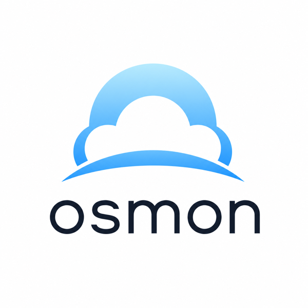
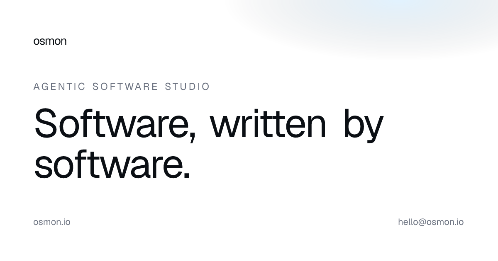

<p align="center">
  <a href="https://osmon.io">
    
  </a>
</p>

<h1 align="center">Your gateway to agentic software.</h1>

<p align="center">
  osmon designs, builds, and operates agent systems for the teams<br>
  shipping the next decade of software.
</p>

<p align="center">
  <a href="https://osmon.io">osmon.io</a>&nbsp;&middot;&nbsp;
  <a href="mailto:hello@osmon.io">hello@osmon.io</a>&nbsp;&middot;&nbsp;
  <a href="https://github.com/osmonlab">@osmonlab</a>
</p>

<p align="center">
  <a href="LICENSE"></a>
  <a href="https://nextjs.org"></a>
  <a href="https://react.dev"></a>
  <a href="https://tailwindcss.com"></a>
  <a href="https://www.typescriptlang.org"></a>
  <a href="https://bun.sh"></a>
  <a href="https://workers.cloudflare.com"></a>
  <a href="https://osmon.io"></a>
  <a href="https://github.com/osmonlab/osmon.io/actions/workflows/ci.yml"></a>
</p>

<br>

<p align="center">
  <a href="https://osmon.io">
    
  </a>
</p>

<br>

## What this repo is

This is the source for [**osmon.io**](https://osmon.io) &mdash; the public face of osmon, an agentic software studio based out of Tashkent and shipping remote-first across Europe and North America.

It is a small, intentionally restrained Next.js 16 site: a home, a journal, a list of selected work, an about, and a way to get in touch. Pure static at the edge.

> **Read-only showcase.** Issues are welcome; external pull requests will be closed politely. The repo exists as a public artefact of the studio&rsquo;s craft, not as a project to collaborate on.

## Stack

- **Next.js 16** &mdash; App Router, Turbopack, RSC, Cache Components-ready
- **React 19** + **TypeScript** strict
- **Tailwind CSS v4** with `@theme` design tokens (no `tailwind.config.*`)
- **Geist Sans &middot; Geist Mono &middot; Newsreader** via `next/font/google`
- **Phosphor Icons** (per the studio&rsquo;s design rules)
- **bun** for installs and scripts
- **Cloudflare Workers** for hosting via [`@opennextjs/cloudflare`](https://opennext.js.org/cloudflare)

## Getting started

```bash
bun install
bun dev          # http://localhost:3000
```

That&rsquo;s it. No environment variables. No external services. The dev server serves the same static output that Cloudflare ships in production.

## Commands

| Command              | Purpose                                                          |
| :------------------- | :--------------------------------------------------------------- |
| `bun dev`            | Local dev server (Turbopack)                                     |
| `bun run build`      | Production build &mdash; runs `tsc` and prerenders all 16 routes |
| `bun run typecheck`  | `tsc --noEmit`                                                   |
| `bun run cf:build`   | Build the OpenNext Worker bundle locally                         |
| `bun run cf:preview` | Run the Worker bundle on `localhost:8787` (production parity)    |
| `bun run cf:deploy`  | Build + deploy to Cloudflare Workers                             |
| `bun run cf:typegen` | Regenerate `cloudflare-env.d.ts` from `wrangler.jsonc` bindings  |

## Architecture

```
app/
  layout.tsx              Nav, Footer, fonts, metadata
  page.tsx                Home — hero, manifesto, capabilities, CTA
  work/                   Selected case studies
  about/                  Studio + principles
  journal/                Index + [slug] entries (draft stub fallback)
  contact/                Email channels + form
  icon.tsx                Favicon (ImageResponse)
  opengraph-image.tsx     Social OG card (1200×630)
  sitemap.ts, robots.ts   SEO plumbing
  not-found.tsx           Branded 404

components/
  nav.tsx                 Floating capsule, scroll-aware, ⌘K trigger
  command-menu.tsx        Full keyboard-driven palette
  hero, manifesto,
  capabilities,           Home sections
  cta-footer
  page-header.tsx         Eyebrow + display headline + lede (sub-pages)
  reveal.tsx              IntersectionObserver fade-up — only motion primitive
  footer.tsx, wordmark.tsx

lib/cn.ts                 className join helper
```

Every route is statically generated. 16 prerendered pages at build time, including five journal entries (two fully written, three rendering a typography-correct draft stub).

## Design rules

- **`#3DA8FF`** is accent only. Fails AA on white as text (~2.8:1). Used for ambient blur, hover, focus ring, pill background, or paired with `text-sky-deep` (#1F6C9F) on `bg-sky-pale`.
- White canvas, `text-ink` (#0B0F14), `border-line` (#EAEAEA) hairlines. Maximum one shadow tier (`0 2px 8px rgba(0,0,0,0.04)`).
- Geist for UI and body. **Newsreader** italic for display emphasis. Mono is reserved for eyebrows, `<kbd>` chips, and metadata.
- Every `<Reveal>`-wrapped block staggers via `delay={i * 80}`. No mass mounts.

## Deployment

Deployed on Cloudflare Workers via OpenNext. The repo is wired to CF Workers Builds &mdash; every push to `main` triggers an auto-deploy.

| Resource           | Detail                                 |
| :----------------- | :------------------------------------- |
| Production         | [`osmon.io`](https://osmon.io)         |
| Worker URL         | `osmon-io.osmonlab.workers.dev`        |
| Build adapter      | `@opennextjs/cloudflare@^1.19`         |
| Wrangler config    | [`wrangler.jsonc`](./wrangler.jsonc)   |
| Compatibility date | `2026-05-01`, flag `nodejs_compat`     |

## License

[MIT](./LICENSE) &middot; &copy; 2026 Osmon Lab.

---

<p align="center">
  <em>Built by the studio. <a href="mailto:hello@osmon.io">Hire us</a> if you&rsquo;re shipping into the next decade.</em>
</p>
